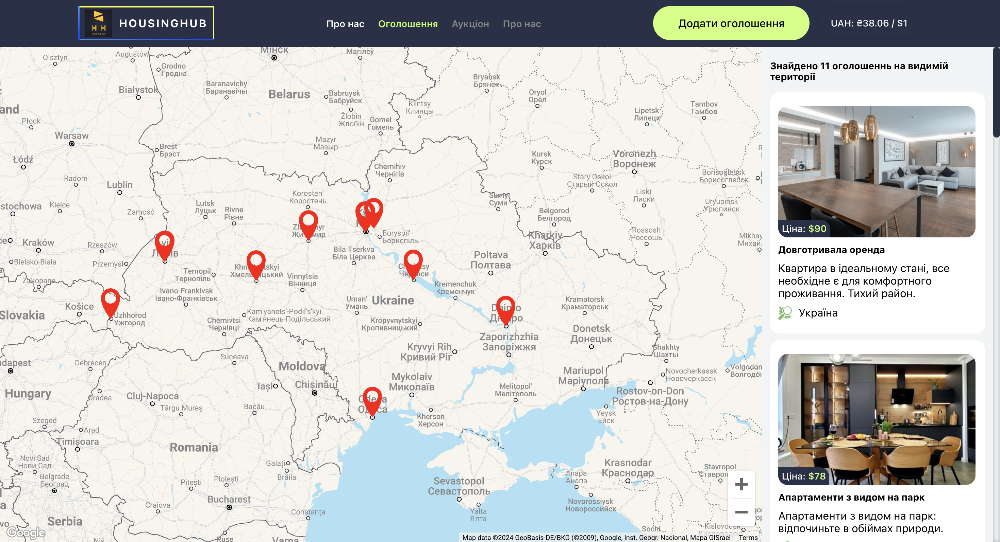
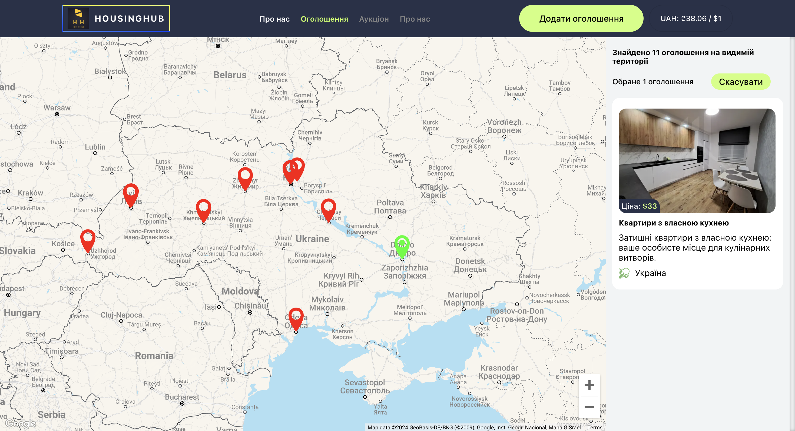
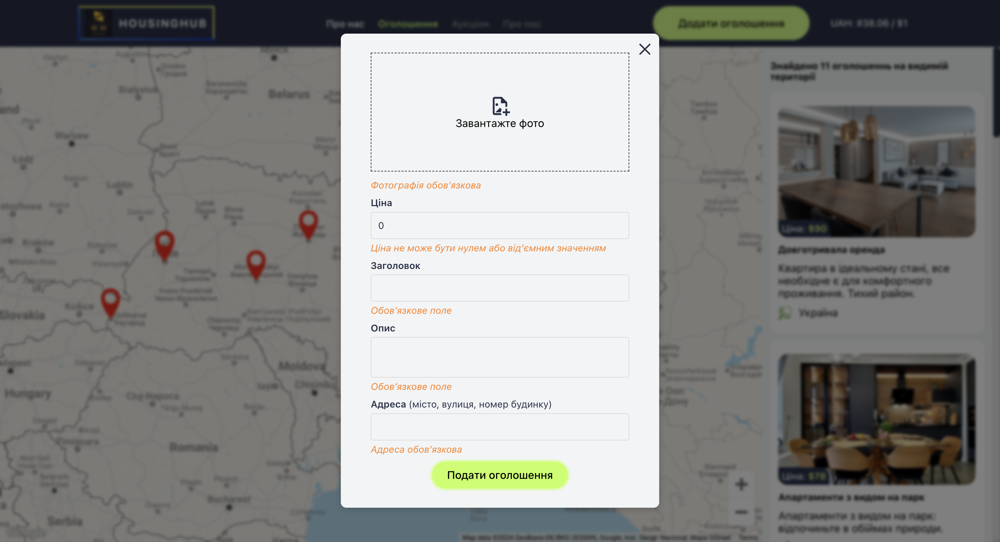
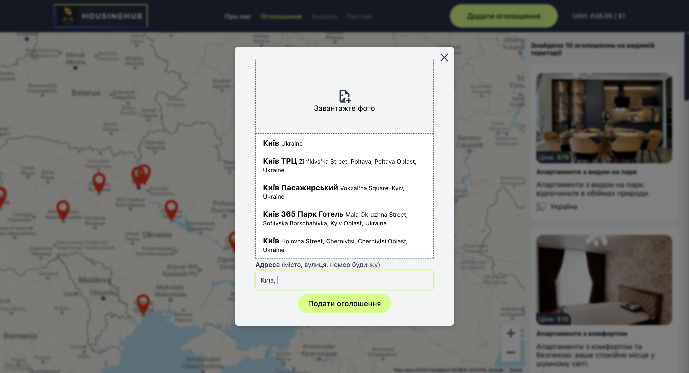

# HOUSING HUB Web Application

<h1 align="center">HousingHub</h1>

  

HousingHub is not just a platform for renting accommodation, but also your
personal manager throughout the process of finding and selecting a new home. We
understand that searching for a new place to live can be a stressful and
time-consuming task, so we created HousingHub to make this process as simple and
enjoyable as possible.

Our team is committed to providing you with convenient tools that will help you
find the perfect accommodation according to your budget, preferences, and needs.
We believe that everyone deserves comfortable and cozy living, so we work
diligently to make this process as pleasant as possible for you.

Let HousingHub be your reliable partner in this important stage of your life,
helping you find not only an apartment but also your new home where you will
feel comfortable and happy.

## Functionality

- **View Listings:** Spend time on our website where you will find a wide
  selection of apartment rental listings. You can view photos, property
  descriptions, and rental terms.

  

- **Integrated Map:** Our interactive map allows you to easily navigate the
locations of available apartments. Each marker on the map indicates the location
of a specific listing, so you can quickly find options closest to you.

  

  

- **Convenient Listing Submission:** Quickly and easily submit your apartment
rental listing using our convenient form. Simply fill in the necessary details,
add photos and descriptions, and submit your listing with just a few clicks.

  

  

- **Intelligent Address Input:** Our listing submission form features
intelligent address input. Simply start typing the address, and the system will
automatically suggest options for selection. Additionally, after entering the
address, the map will automatically move to display the location of your
property.

  

  

#### Let HousingHub be your guide in the world of housing rentals, providing convenience and reliability at every step of your journey.

## Technologies and Dependencies

#### React:

React is a JavaScript library for building user interfaces that allows you to
create dynamic and high-performing web applications. GooseTracks is based on
React, making it easy to create components and manage the application's state.

#### React-Redux:

React-Redux is a library for integrating Redux into your React applications,
simplifying the communication between Redux state and React components.

#### Redux Toolkit:

Redux Toolkit is a library for managing your application's state in React
projects. It helps organize and streamline state management by centralizing it
and providing debugging tools.

#### React Router DOM:

React Router DOM is a library for navigation and routing in React applications,
allowing you to create routes and navigate between pages.

#### Formik:

Formik is a form library for React that helps with the management of form state,
validation, and submission. It simplifies the process of building complex forms
by handling form-related tasks efficiently.

#### @React-Google-Maps/api:

@react-google-maps/api is a library for integrating Google Maps into React
applications. It provides React components and hooks to easily embed interactive
Google Maps and utilize Google Maps services within your application.

#### React-Cool-Onclickoutside:

react-cool-onclickoutside is a React hook for handling clicks outside of a
specified element. It helps in implementing functionalities like closing
dropdowns or modals when users click outside of them, enhancing the user
experience.

#### Use-Places-Autocomplete:

Use-places-autocomplete is a React hook that provides an easy-to-use interface
for implementing Google Places Autocomplete functionality in your application.
It simplifies the integration of autocomplete features for location search,
making it convenient for users to input addresses.

#### React-Toastify:

React-toastify is a library for displaying toast notifications in React
applications. It offers customizable and responsive toast messages that can be
used to provide feedback or alert users about important events in the
application.

### Thank you for choosing our web application for viewing and submitting ads! Enjoy using it!
