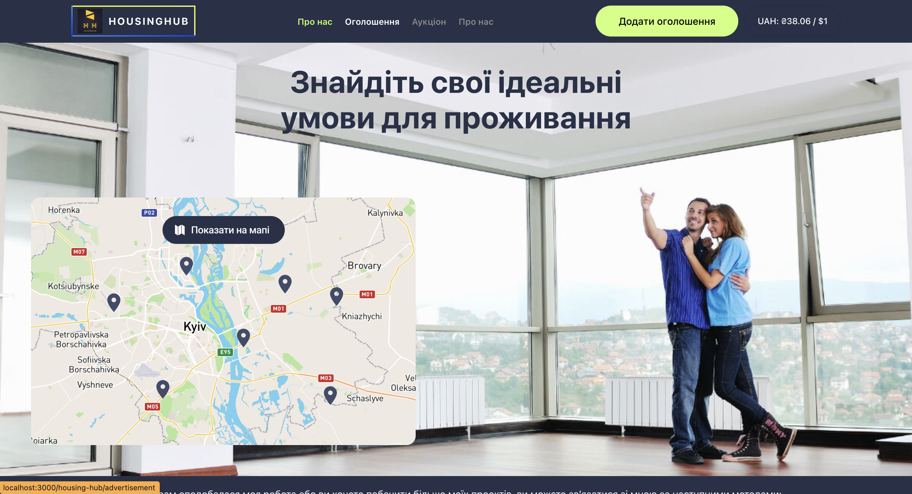
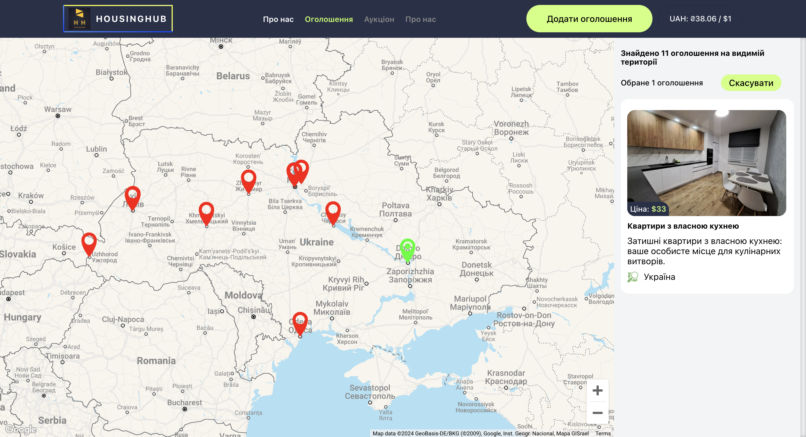

# HOUSING HUB Web Application

<h1 align="center">HousingHub</h1>

  

HousingHub - це не лише платформа для оренди житла, але й ваш особистий керівник
у всьому процесі знаходження і вибору нового домівки. Ми розуміємо, що пошук
іншого місця проживання може бути напруженим і часом споживаючим завданням, тому
ми створили HousingHub, щоб зробити цей процес якнайпростішим і приємним.

Наша команда віддана тому, щоб забезпечити вас зручними інструментами, які
допоможуть вам знайти ідеальне житло, відповідно до вашого бюджету, уподобань та
потреб. Ми віримо, що кожна людина заслуговує на комфортне та затишне
проживання, тому ми працюємо наполегливо, щоб зробити цей процес якнайприємнішим
для вас.

Нехай HousingHub стане вашим надійним партнером у важливому етапі вашого життя,
допомагаючи вам знайти не лише квартиру, але й ваш новий дім, де ви будете
відчувати себе комфортно і щасливо.

## Основні функції

- **Перегляд Оголошень:** Проведіть час на нашому веб-сайті, де ви знайдете
  широкий вибір оголошень про оренду апартаментів. Ви можете переглядати
  фотографії, опис житла та умови оренди.

  

- **Інтегрована Карта:** Наша інтерактивна карта дозволяє вам легко
зорієнтуватися в місцях розташування доступних квартир. Кожен маркер на карті
позначає місце розташування конкретного оголошення, щоб ви могли швидко знайти
найближчі до вас варіанти.

  

  

- **Зручна Подача Оголошень:** Швидко та легко подайте своє оголошення про
оренду апартаментів за допомогою нашої зручної форми. Просто заповніть необхідні
дані, додайте фотографії та опис і надішліть своє оголошення всього кількома
клацаннями.

  

  

- **Інтелектуальне Введення Адреси:** Наша форма для подачі оголошень оснащена
інтелектуальним введенням адреси. Просто почніть вводити адресу, і система
автоматично запропонує варіанти для вибору. Крім того, після введення адреси
карта автоматично переміститься, щоб відобразити місце, на якому знаходиться
ваше житло.

  

  

#### Нехай HousingHub стане вашим провідником у світі оренди житла, забезпечуючи зручність і надійність на кожному кроці вашого шляху.

## Технології та залежності

#### React:

React - це бібліотека JavaScript для побудови інтерфейсів користувача, яка
дозволяє створювати динамічні та високопродуктивні веб-додатки. GooseTracks
базується на React, що спрощує створення компонентів та управління станом
додатка.

#### React-Redux:

React-Redux - це бібліотека для інтеграції Redux у ваших додатках React, що
спрощує взаємодію між станом Redux та компонентами React.

#### Redux Toolkit:

Redux Toolkit - це бібліотека для управління станом вашого додатка у проектах
React. Вона допомагає організувати та оптимізувати управління станом,
централізуючи його та надаючи інструменти для налагодження.

#### React Router DOM:

React Router DOM - це бібліотека для навігації та маршрутизації в додатках
React, яка дозволяє створювати маршрути та переходити між сторінками.

#### Formik:

Formik - це бібліотека для форм у React, яка допомагає у керуванні станом форми,
валідації та відправлення. Вона спрощує процес створення складних форм,
обробляючи пов'язані з формою завдання ефективно.

#### @React-Google-Maps/api:

@react-google-maps/api - це бібліотека для інтеграції Google Maps у додатки
React. Вона надає компоненти та хуки React для легкої вставки інтерактивних карт
Google та використання сервісів Google Maps у вашому додатку.

#### React-Cool-Onclickoutside:

react-cool-onclickoutside - це хук React для обробки кліків за межами вказаного
елемента. Він допомагає в реалізації функціоналу, наприклад, закриття випадаючих
списків або модальних вікон при кліку поза ними, покращуючи взаємодію з
користувачем.

#### Use-Places-Autocomplete:

Use-places-autocomplete - це хук React, який надає зручний інтерфейс для
реалізації автозаповнення Google Places у вашому додатку. Він спрощує інтеграцію
функціоналу автозаповнення для пошуку місць, що дозволяє користувачам зручно
вводити адреси.

#### React-Toastify:

React-toastify - це бібліотека для відображення сповіщень типу "toast" у
додатках React. Вона пропонує налаштовані та адаптивні повідомлення "toast", які
можна використовувати для надання зворотного зв'язку або сповіщення користувачів
про важливі події у додатку.

### Дякуємо, що вибрали наш веб-додаток для перегляду та подачі оголошень! Користуйтеся ним із задоволенням!
